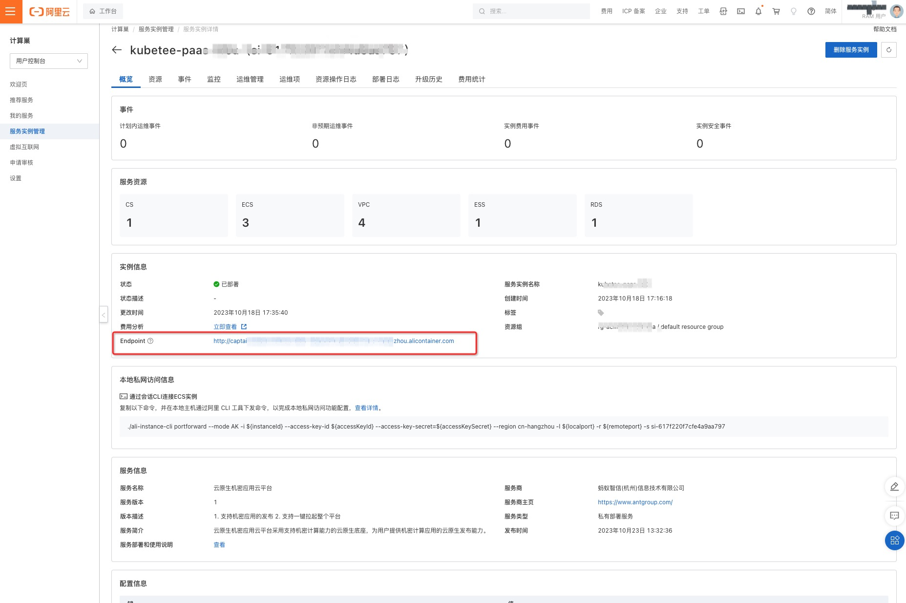
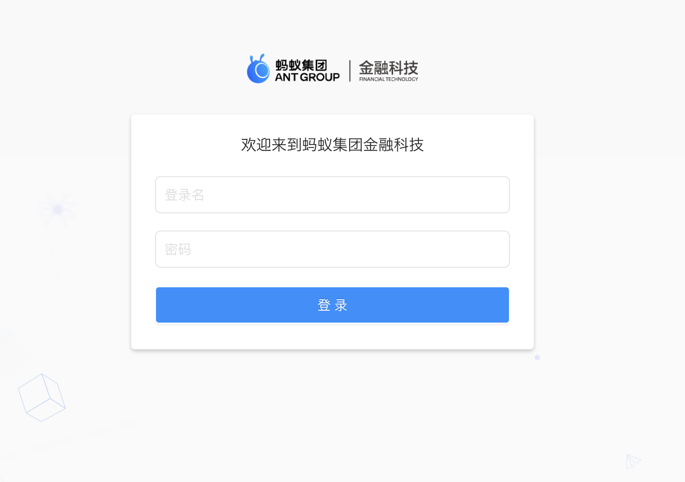
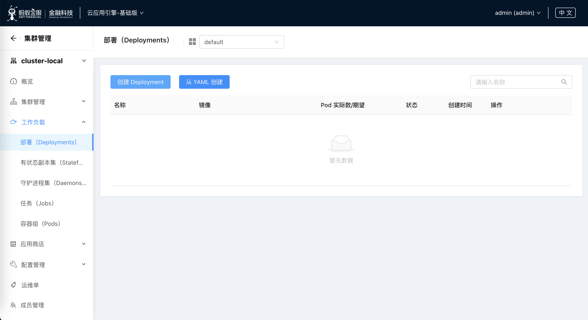
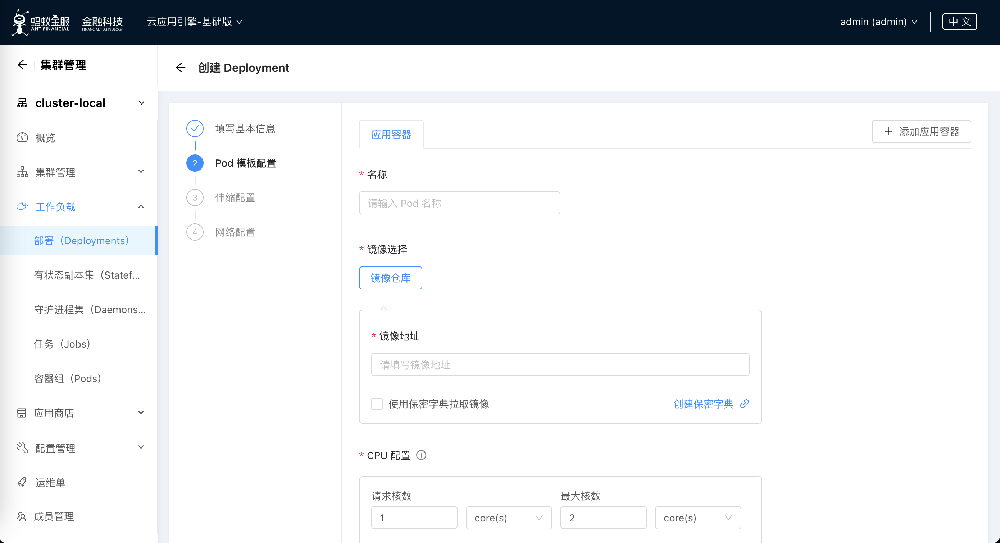

# 机密应用云平台服务实例部署文档

## 概述

基于云原生机密计算底座，提供机密应用的全生命周期管理和开箱即用的基础服务接口，帮助用户快速实现和部署云上机密应用服务。

目前机密应用云平台处于**免费**试用阶段，欢迎大家申请试用，期间发现任何问题也欢迎反馈交流。

## 计费说明

机密计算云平台在计算巢上的费用主要涉及：

- ACK Worker 节点规格
- ACK Worker 节点系统盘类型及容量
- 数据库类型及规格

计费方式包括：

- 按量付费（小时）
- 包年包月

目前提供如下实例：

| Worker 节点规格 | Worker 节点系统盘大小 | Worker 节点系统盘磁盘类型 | MySQL 实例系列 | MySQL 实例规格 | MySQL 实例磁盘大小 | MySQL 实例存储类型 |
| --- | --- | --- | --- | --- | --- | --- |
| ecs.g7t.4xlarge 安全增强通用型 g7t, 4vCPU 32GiB | 60BiB | ESSD云盘 | 基础版 | mysql.n2.medium.1, 2vCPU 4GiB | 30GiB | ESSD云盘 |
| ecs.g7t.6xlarge 安全增强通用型 g7t, 24vCPU 96GiB | 120BiB | ESSD云盘 | 高可用版 | rds.mysql.s2.large, 2vCPU 4GiB | 30GiB | ESSD云盘 |

预估费用在创建实例时可实时看到。
如需更多规格、其他服务（如集群高可用性要求等），可使用自定义规格。

## 部署流程

### 前置条件

- RAM账号所需权限: 机密应用云平台服务需要对ACK、ECS、VPC等资源进行访问和创建操作，若您使用RAM用户创建服务实例，需要在创建服务实例前，对使用的RAM用户的账号添加相应资源的权限。添加RAM权限的详细操作，请参见[为RAM用户授权](https://help.aliyun.com/document_detail/121945.html)。所需权限如下表所示。

| --- | --- |
| 权限策略名称                      | 备注                                    |
|---------------------------------|---------------------------------------|
| AliyunCSFullAccess              | 管理容器服务(CS)的权限             |
| AliyunECSFullAccess             | 管理云服务器服务（ECS）的权限             |
| AliyunVPCFullAccess             | 管理专有网络（VPC）的权限                 |
| AliyunRDSFullAccess             | 管理云数据库服务(RDS)的权限               |
| AliyunROSFullAccess             | 管理资源编排服务（ROS）的权限             |
| AliyunComputeNestUserFullAccess | 管理计算巢服务（ComputeNest）的用户侧权限  |
| AliyunCloudMonitorFullAccess    | 管理云监控（CloudMonitor）的权限          |

### 部署步骤

1. 进入服务实例部署页面，您可以在阿里云计算巢自行搜索，也可以通过该 [部署链接](https://computenest.console.aliyun.com/user/cn-hangzhou/serviceInstanceCreate?ServiceId=service-ddb57df594fa46428172&isTrial=true) 快速到达。

2. 填写申请试用的表单，在审核通过后，就可以创建机密应用云平台服务。

3. 根据服务实例创建的界面提示，填写参数并提交部署。

### 部署参数说明

您在创建服务实例的过程中，需要配置服务实例的参数，各参数说明如下：

| 参数项 | 示例 | 说明 |
| --- | --- | --- |
| 服务实例名称 | test | 实例的名称 |
| 地域 | 华北1（杭州） | 选中服务实例的地域，建议就近选中，以获取更好的网络延时。 |
| 可用区 | 可用区K | 地域下的不同可用区域，确保实例非空。 |
| 选择套餐 | 试用版、标准版、自定义套餐 | 根据实际需求选择套餐 |
| 登录密码 | ******  | 设置机密应用云平台登录密码，用户名默认为 `antCloudAdmin`。长度8~30个字符，必须包含三项（大写字母、小写字母、数字、 ()`~!@#$%^&*_-+={}[]:;'<>,.?/ 中的特殊符号）。 |

### 验证结果

1. 进入 **服务实例详情页** ，可以在 **部署日志** 中查看服务实例部署过程，部署时间大约需要 15 分钟。部署完成后，可以在 **概览** 中看到部署状态为 **已部署**。 
2. 部署完成后，进入 **服务实例详情页**，可以在 **概览-实例信息-Endpoint** 获取到服务的访问地址，点击该地址即可访问机密应用云平台。

## 使用机密应用云平台

### 创建应用

1. 点击 **服务实例详情页-概览-实例信息-Endpoint** 进入机密应用云平台。

2. 在登录页面输入用户名密码，用户名默认为 antCloudAdmin，密码为创建服务实例时配置的登录密码。

3. 登录成功后，进入 cluster-local 集群管理页面，在 **工作负载-部署(Deployments)** 页面中，点击 **创建 Deployment** 按钮。

4. 根据页面提示，填写表单并提交：
    - 镜像地址：需要填写可被公网拉取的镜像地址，如果是私有镜像，可以配置保密字典来拉取镜像。
    - 加密内存: 机密应用所需的加密内存资源数，集群中可使用的加密内存资源数可以在 **集群管理-节点** 中查看。

5. 查看应用状态，待 Pod 实际数 与 期望数 一致时，则部署完成。

## 问题排查

### 问题一：部署区域无可用资源

有时，所选部署区域（如可用区G）没有所选套餐的可用资源，会报错如下图所示

**解决办法**：尝试选择其他区域，如可用区I等

### 问题二: 启动后web访问不通

web的启动需要一点点时间，请稍后刷新页面即可。

### 问题三: 登录时的用户名密码不正确

请注意检查，登录时使用的密码应为创建服务实例时填写的 **登录密码**，用户名默认为 antCloudAdmin
